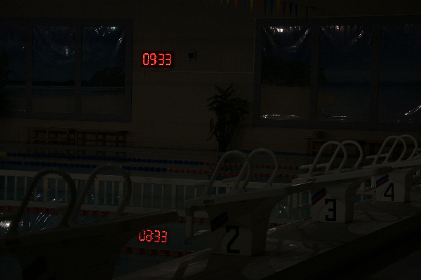
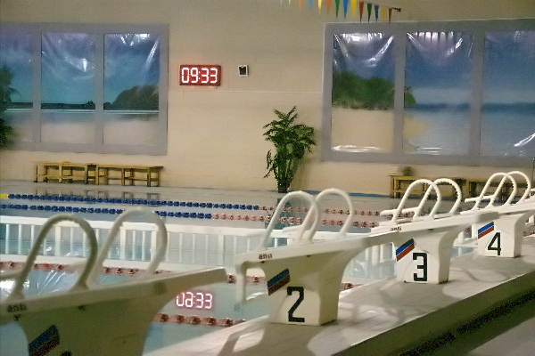

# 🌟 IllumiRefine AI
**A Hybrid Architecture Combining Self-Calibrated Illumination and Adaptive Frequency Fusion for Extreme Low-Light Image Enhancement.**

[](https://illumi-refine-ai.vercel.app/)
[]()
[]()
[]()
[]()

Developed as a Master's (M.Sc. Data Science) research project at **Dhirubhai Ambani University**.

---

## 📑 Table of Contents
1. [Project Overview](#-project-overview)
2. [Algorithmic Pipeline (The Science)](#-algorithmic-pipeline)
   - [Phase 1: Homomorphic Filtering](#phase-1-homomorphic-filtering)
   - [Phase 2: Self-Calibrated Illumination (SCI)](#phase-2-self-calibrated-illumination-sci)
   - [Phase 3: SCI-Guided Adaptive Fusion (Novel Contribution)](#phase-3-sci-guided-adaptive-fusion-novel-contribution)
3. [System Architecture](#-system-architecture)
4. [Visual Results](#-visual-results)
5. [Installation & Local Setup](#-installation--local-setup)
6. [Cloud Deployment](#-cloud-deployment)
7. [Future Work](#-future-work)
8. [Contributors & Acknowledgments](#-contributors--acknowledgments)

---

## 🚀 Project Overview
**IllumiRefine AI** is a full-stack, end-to-end algorithmic framework designed to recover structural fidelity, maintain color constancy, and suppress heavy sensor noise in images captured under extreme low-light and High Dynamic Range (HDR) conditions. 

Transitioning from classical Fourier-domain mathematics to state-of-the-art unsupervised deep learning, the final deployed system utilizes an ultra-lightweight Convolutional Neural Network (under 1MB) fused with adaptive mathematical post-processing to deliver near real-time, professional-grade enhancement.

---

## 🧠 Algorithmic Pipeline

### Phase 1: Homomorphic Filtering
The project began by modeling Retinex theory in the frequency domain. By applying a natural logarithm to the image, we transformed the multiplicative relationship between illumination and reflectance into an additive one. We then utilized a **2D Fast Fourier Transform (FFT)** and a **Gaussian High-Pass Filter** to suppress low-frequency shadows while preserving high-frequency edges.

### Phase 2: Self-Calibrated Illumination (SCI)
To overcome the limitations of static mathematical filters, we implemented the unsupervised deep learning **SCI Framework (CVPR 2022)**. 
- **Training:** Utilizes a cascaded learning process with a self-calibrated module to force network convergence without paired ground-truth data.
- **Inference:** The live model drops the complex calibration module, relying on a single block of only three `3x3` convolutions. This results in an operational footprint of merely **0.0619 GigaFLOPs** and an inference speed of `< 2 seconds` on cloud CPUs.

### Phase 3: SCI-Guided Adaptive Fusion *(Novel Contribution)*
Standard Retinex deep learning models suffer from mid-tone dullness and severe noise amplification in pitch-black regions. We engineered a custom post-processing hybrid layer:
1. **Adaptive Exposure & Fractional Gamma:** The AI's predicted spatial illumination tensor is boosted via an exposure gain matrix and fractional power-law compression, safely lifting deep shadows without blowing out HDR highlights (like digital clocks).
2. **Illumination-Guided Denoising Mask:** We generate a candidate image using Fast Non-Local Means (NLM) denoising. Using the AI's illumination map as an alpha-blend mask, we mathematically fuse the images. Pitch-black areas rely on the denoised matrix, while naturally bright areas rely on the raw, sharp matrix.

---

## 🏗 System Architecture

The project utilizes a decoupled, microservice-based architecture to ensure global scalability:
* **Frontend (Client):** `React.js` and `Tailwind CSS`. Manages local state, file handling, and blob encoding. Deployed on **Vercel's Edge Network**.
* **Backend (API):** `FastAPI` (Python 3.11). Handles asynchronous POST requests, dynamic tensor allocation, and HTTP byte streaming. 
* **Inference Engine:** `PyTorch` and `OpenCV`. Converts multipart form data to `(N, C, H, W)` tensors, runs the `torch.no_grad()` AI inference, applies the Adaptive Fusion math, and re-encodes to PNG. Deployed on **Hugging Face Spaces**.

---

## 📸 Visual Results

*(Note: Add your actual images to a `docs` or `assets` folder in your repo and update these links)*

| Input (Extreme Low-Light) | Output (Adaptive Fusion Enhanced) |
| :---: | :---: |
|  |  |
| *Original HDR scene. Severe photon deprivation obscures the pool structure.* | *Enhanced result. Noise is completely suppressed; red digital clock remains crisp without overexposing.* |

---

## 💻 Installation & Local Setup

### 1. Clone the Repository
```bash
git clone [https://github.com/Kunal-Pramanik/IllumiRefine-AI.git](https://github.com/Kunal-Pramanik/IllumiRefine-AI.git)
cd IllumiRefine-AI
```
### 2. Backend Setup (PyTorch & FastAPI)
Ensure you have Python 3.11+ installed.

Bash
cd backend
# Create a virtual environment
python -m venv venv
source venv/bin/activate  # On Windows use `venv\Scripts\activate`

# Install dependencies (Uses CPU-optimized PyTorch)
pip install -r requirements.txt

# Start the local API
python main.py
The backend will be available at http://localhost:8000.

3. Frontend Setup (React)
Open a new terminal window.

Bash
cd frontend

# Install Node modules
npm install

# Start the development server
npm start
The UI will automatically open at http://localhost:3000.

Important: To route the local frontend to your local backend, ensure const API_URL = "http://localhost:8000/enhance"; is set in App.js.

☁️ Cloud Deployment
Hugging Face (Backend)
Create a new Hugging Face Space (Docker/FastAPI).

Upload the backend contents.

Ensure requirements.txt contains --extra-index-url https://download.pytorch.org/whl/cpu to prevent CUDA memory overflows during the Docker build.

Upload the pre-trained weights to weights/difficult.pt.

Vercel (Frontend)
Push the repository to GitHub.

Import the frontend directory into a new Vercel project.

Ensure the API_URL in App.js points to your live Hugging Face Space URL before pushing to production.

🔮 Future Work
Real-Time Video Stream Enhancement: Integrating temporal consistency loss functions and recurrent memory blocks (LSTMs) to prevent frame-flickering in security feeds.

Edge Computing: Quantizing the 32-bit floating-point weights to 8-bit integers and converting the model to TensorFlow Lite for native smartphone/drone deployment.

Downstream Vision Integration: Pipelining the enhanced tensors directly into YOLOv8 for dark-scene object detection and autonomous navigation.

🤝 Contributors & Acknowledgments
Developers:

Kunal Pramanik (M.Sc. Data Science, Dhirubhai Ambani University)

Chauhan Aman Satapal (M.Sc. Data Science, Dhirubhai Ambani University)

Academic Guide:

Dr. Srimanta Mandal (Associate Professor, Dhirubhai Ambani University)

Special thanks to the authors of the Self-Calibrated Illumination (CVPR 2022) framework for their open-source contributions to the computer vision community.
